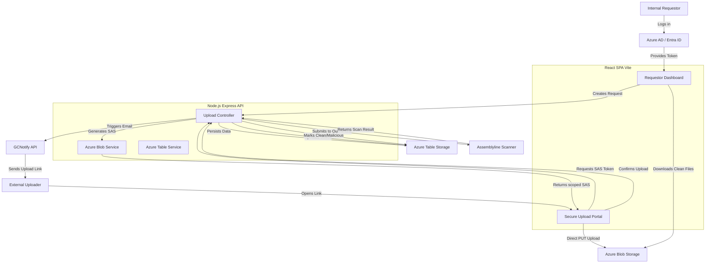
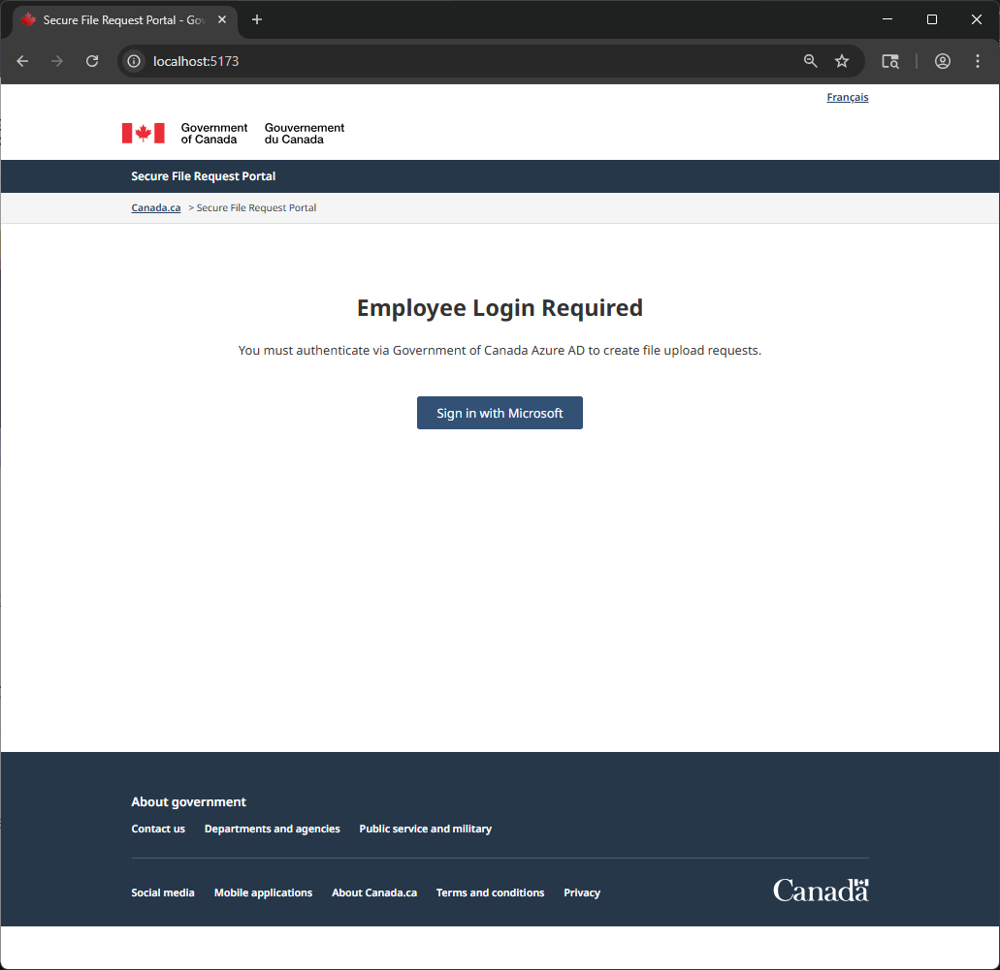
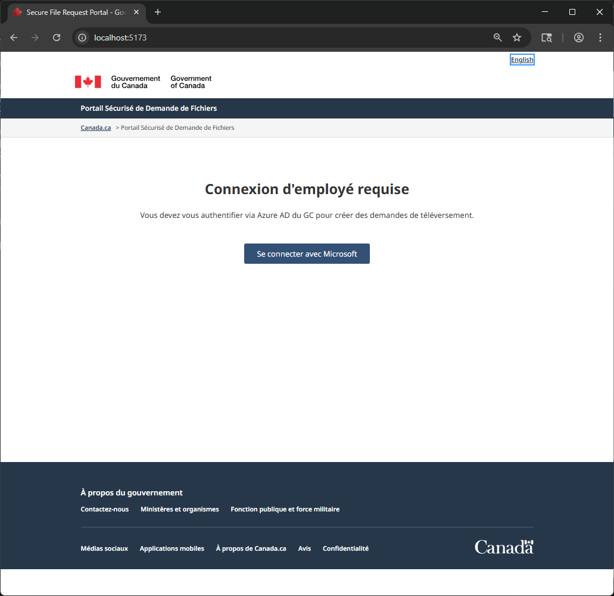
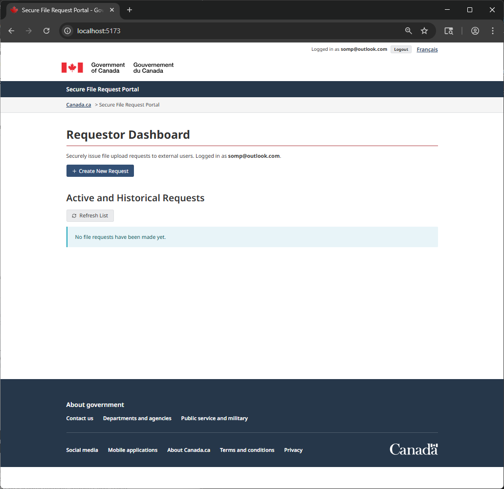

# Requestor-Uploader Assistant

The Requestor-Uploader Assistant is a full-stack Node.js application that enables internal users to request sensitive documents from external users via a secure, masked, and trackable direct-to-cloud upload portal.

## Architecture

The system utilizes an Express backend serving a React SPA frontend. Cloud infrastructure leverages Azure Storage services for blob uploads and NoSQL tracking, with GCNotify for secure email delivery and Assemblyline for malware scanning.

## Security Posture
- **Masked Storage**: Uploaders never see the actual destination container. They are provided a short-lived (1-hour) Shared Access Signature (SAS) token permitting write-only execution to a specific generated blob name.
- **Quarantine Pipeline**: All files are placed in an isolated blob path until scanned and explicitly marked as `Clean` by Assemblyline.

## Setup Instructions
Please refer to the enclosed walkthrough artifacts or run locally via:
1. `cd backend && node server.js`
2. `cd frontend && npm run dev`

## UI Demo

### Bilingual Support (English/French)

*Note: In the demo above, mock API failures may occur if the local Azurite Azure Storage Emulator is not running, but the UI is fully functional.*

## Demo

Federated User Login via Entra ID 

Creating new Request

French Language Support

