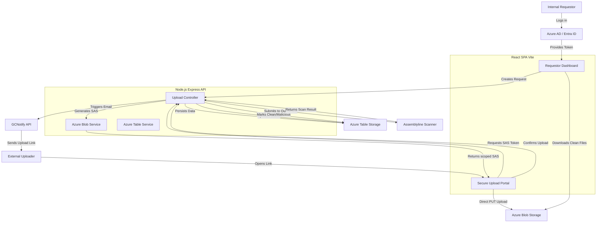
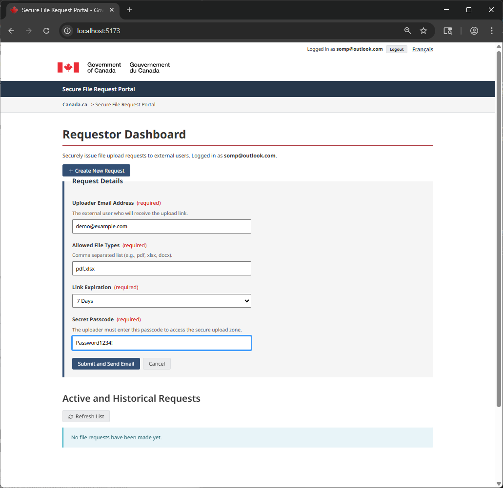
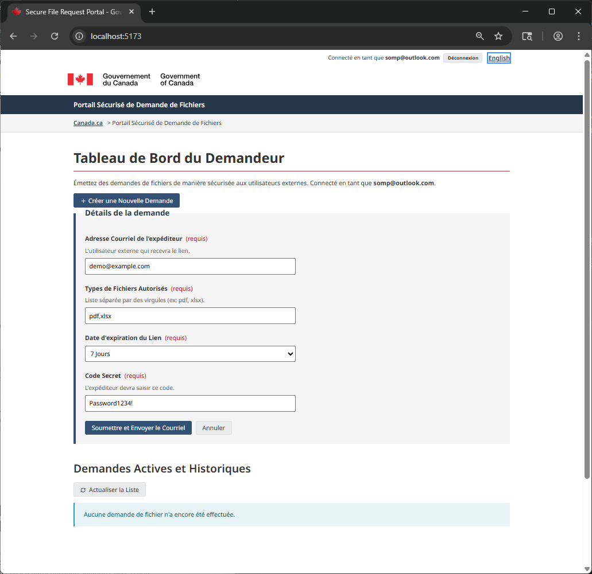
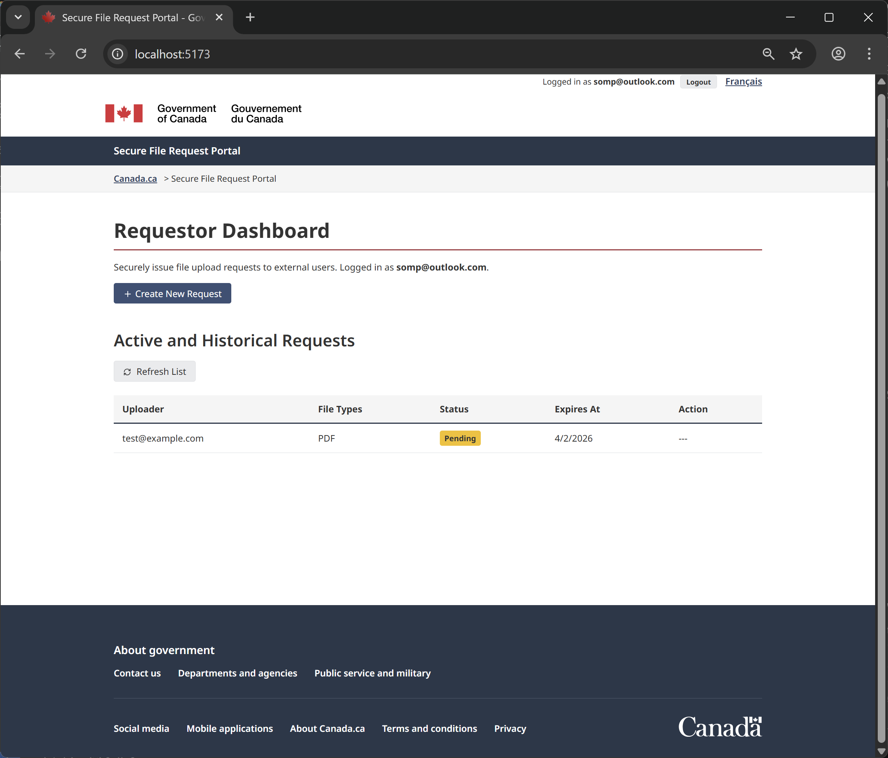
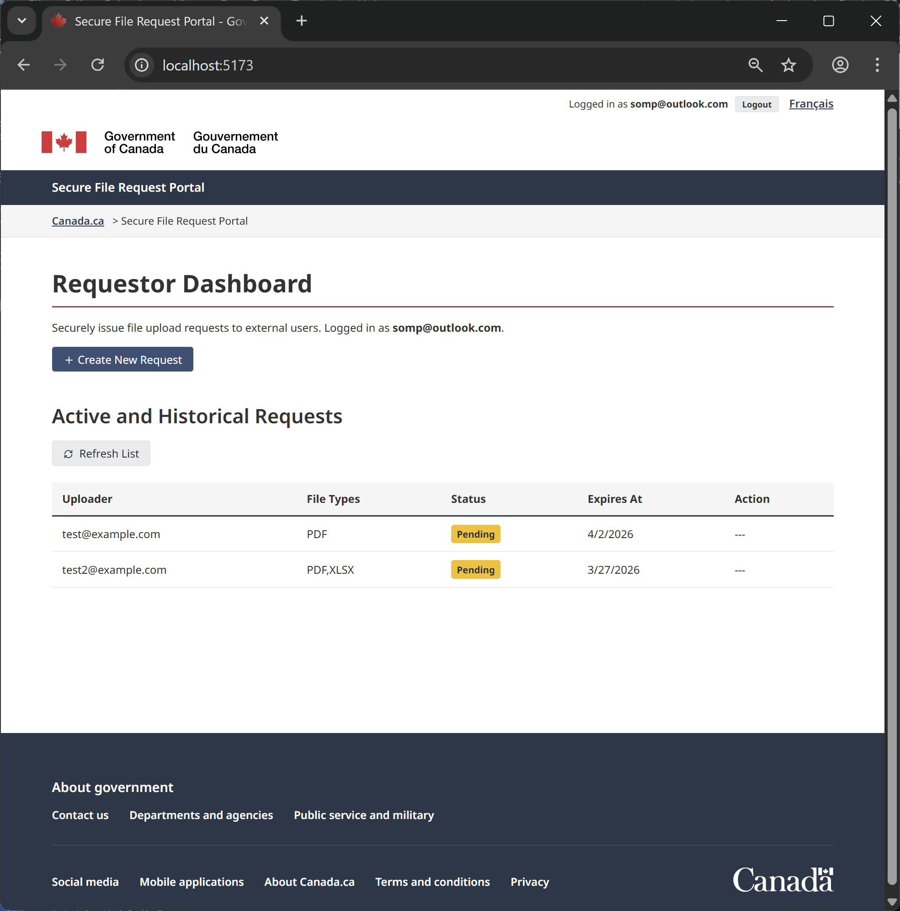
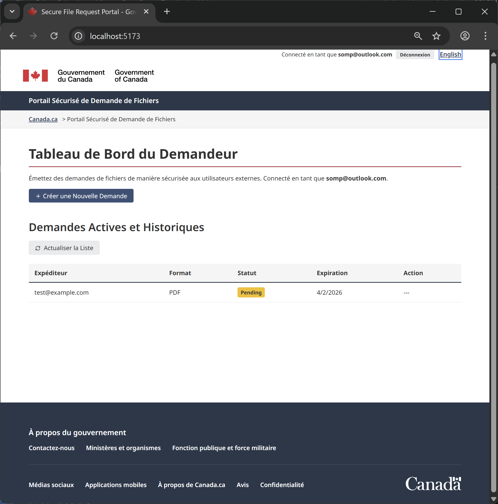
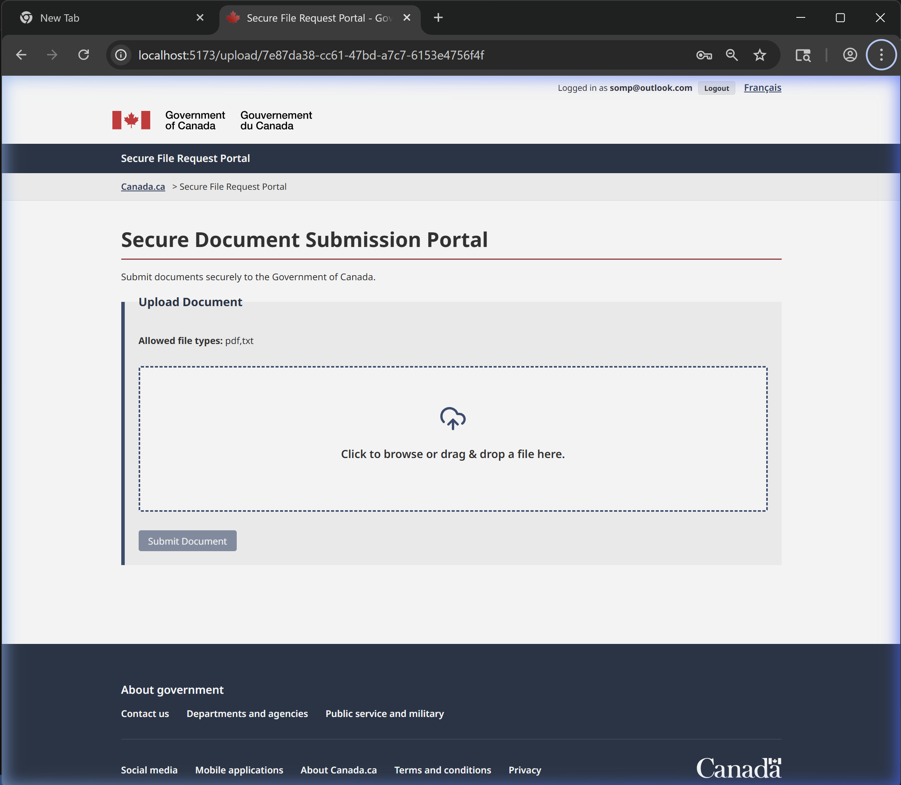
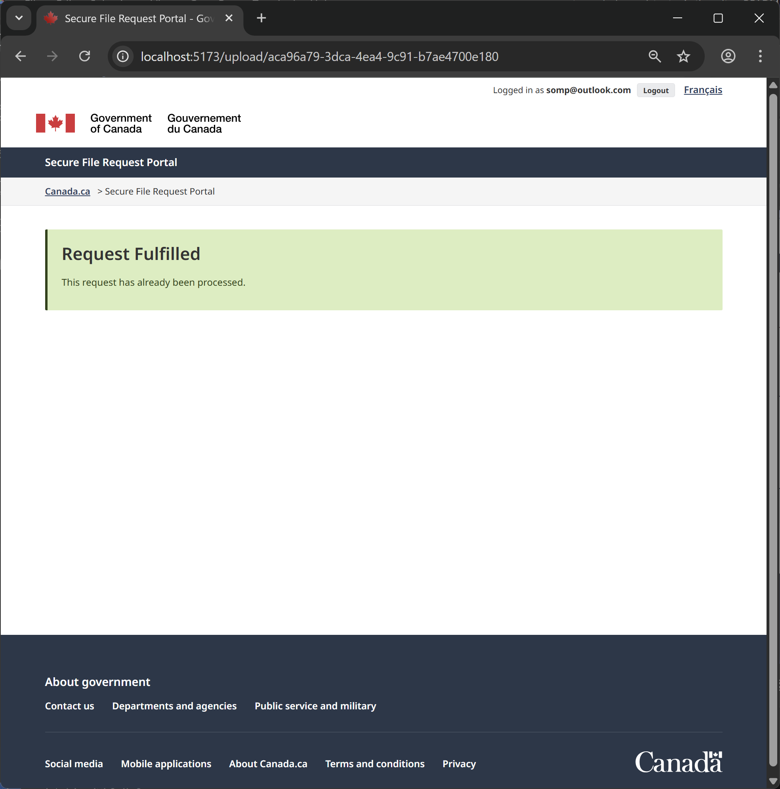
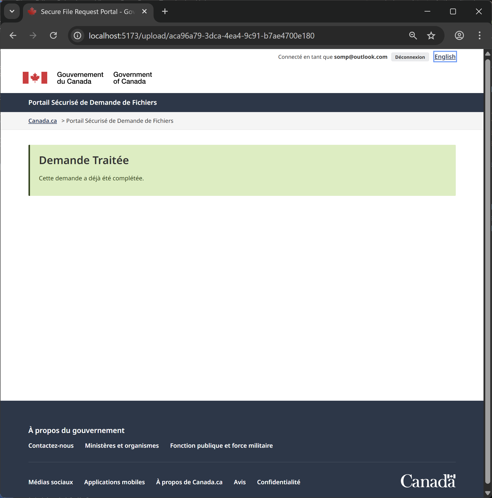

# Secure File Portal Assistant

The Secure File Portal Assistant is a full-stack Node.js application that enables internal users to request sensitive documents from external users via a secure, masked, and trackable direct-to-cloud upload portal.

## Architecture

The system utilizes an Express backend serving a React SPA frontend. Cloud infrastructure leverages Azure Storage services for blob uploads and NoSQL tracking, with GCNotify for secure email delivery and Assemblyline for malware scanning.



## Security Posture
- **Masked Storage**: Uploaders never see the actual destination container. They are provided a short-lived (1-hour) Shared Access Signature (SAS) token permitting write-only execution to a specific generated blob name.
- **Quarantine Pipeline**: All files are placed in an isolated blob path until scanned and explicitly marked as `Clean` by Assemblyline.

## Setup Instructions
Please refer to the enclosed walkthrough artifacts or run locally via:

### Azurite (Local Azure Storage Emulator)
To test the file upload functionality locally, you need the Azure Storage Emulator running.
You can run a Docker container for Azurite via Ubuntu WSL:

1. Open Ubuntu WSL.
2. Install docker engine with command:
   ```bash
   sudo curl -sSL https://get.docker.com | sh
   ```
3. Run the Azurite container:
   ```bash
   sudo docker run -p 10000:10000 -p 10001:10001 -p 10002:10002 mcr.microsoft.com/azure-storage/azurite azurite --skipApiVersionCheck --blobHost 0.0.0.0 --queueHost 0.0.0.0 --tableHost 0.0.0.0
   ```

### Running the Application
1. **Backend**:
   `cd backend && npm run build && npm start`
2. **Frontend**:
   `cd frontend && npm run dev`

# Secure File Portal Verification Walkthrough

The Secure File Portal Assistant application is now completely developed. It includes the React frontend, the Express backend, and mock services for Azure Storage, Azure Data Tables, GCNotify, and Assemblyline to allow for complete local verification without requiring cloud keys immediately.

## Application Components Completed

- **Frontend (`/frontend`)**: React application using Vite, stylized with modern glassmorphism Vanilla CSS.
  - `RequestorDashboard.jsx`: Displays your active requests, their statuses, and allows creating a new upload link.
  - `UploaderView.jsx`: The secure upload portal for external users. Generates short-lived Azure Blob SAS tokens in the background to handle direct and masked file uploads.
- **Backend (`/backend`)**: Express API server.
  - `server.js`: Web server and mocked authentication middleware.
  - `azureBlobService.js`: Scoped SAS token generator.
  - `azureTableService.js`: Lightweight NoSQL tracking for request stages and file lifecycle tracking.
  - `gcNotifyService.js`: Wrapper for GCNotify emails (currently mocks to console limit API usage during testing).
  - `assemblylineService.js`: Simulates a 10-second quarantine and scan, marking the file clean automatically.

## How to Test and Verify

Since Azure Table storage is configured to use the local Emulator by default, you will need the Azure Storage Emulator (Azurite) running if you don't provide actual `.env` keys.

1. **Start the Backend**:
```powershell
cd backend
npm install
npm run build
npm start
```

2. **Start the Frontend**:
```powershell
cd frontend
npm install
npm run dev
```

3. **Verify the Flow**:
   - Open your browser to `http://localhost:5173`.
   - You will see the Requestor Dashboard. Click **`New Request`**.
   - Input an email address and click **`Create & Send Email`**.
   - In your *Backend terminal*, you will see a mock GCNotify log with the upload link.
   - Copy that link, and open it in a new tab (this is the Uploader's view).
   - Drop a PDF or XLSX file into the zone and hit **`Submit`**.
   - The file will upload immediately to Blob Storage.
   - Go back to the Requestor Dashboard and click **`Refresh`**. You will see it listed as `Scanning`.
   - Wait 10 seconds, refresh again, and it will say `Clean` with a Download button!

> [!TIP]
> To hook up real Azure services and GCNotify, create a `.env` file in the `backend/` directory with:
> - `AZURE_STORAGE_ACCOUNT_NAME`
> - `AZURE_STORAGE_ACCOUNT_KEY`
> - `GCNOTIFY_API_KEY`

### Verification

Triggered an immediate mock upload with a sample `test.txt` via an API pipeline mimicking exactly what the React UI does, testing the full lifecycle:

1. Generated a new request via `POST /api/requests`.
2. Grabbed the upload link generated.
3. Authenticated the Uploader page with the secret `passcode`.
4. Acquired the one-time short-lived upload SAS token `(/api/public/requests/.../sas)`.
5. Transferred `test.txt` explicitly into the uploads Blob container payload.
6. Instructed the backend to trigger confirmation `(/confirm)`.
7. Refreshed the dashboard list `(GET /requests)`: Validated that the status successfully flipped to `Scanning`.
8. After 10 simulated seconds of the Assemblyline pipeline timeout, I refreshed the list again, and it successfully transitioned to Clean!

"Refresh list" button logic natively leverages this `fetchRequests` mapped call, so clicking it will completely and accurately update the screen statuses without needing to reload the entire Web UI.


## UI Demo

Bilingual Support (English/French)

### Demo


Federated User Login via Entra ID 


Creating new Request


French Language Support



Test send request and view status




French Language Support status



Upload document


Document has been uploaded


French Language Support Document has been uploaded
